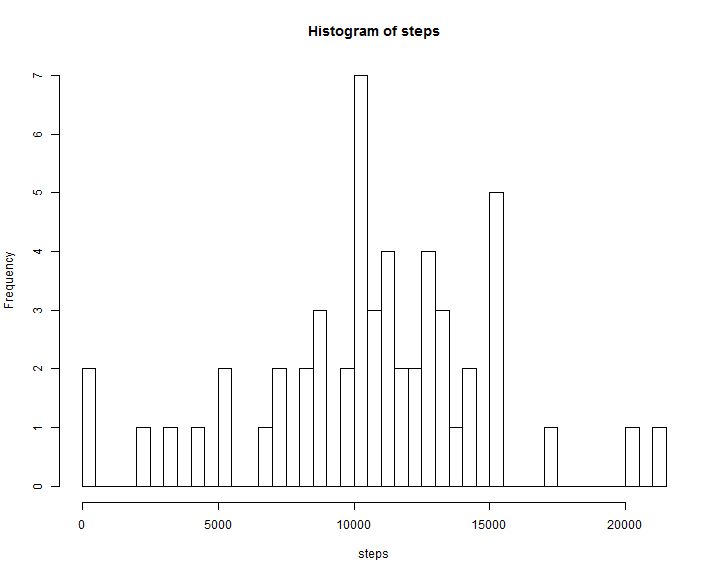

# Reproducible Research: Peer Assessment 1
==================================================


## Loading and preprocessing the data

_**1. Load the data (i.e. read.csv())**_
* Setup the appropriate working directory which is same as the directory where you have cloned the RepData_PeerAssessment1 from github  
* This project contains the activity.zip. Unzip the file by using the unzip command.It will extract the activity.csv file in the same directory  
* Read the data including it's header from activity.csv file by using the read.csv command  
	

```r
 setwd("C:\\Balakrishnan\\Learning\\Coursera\\Data Science\\Reproducible Search\\Week2\\ws\\RepData_PeerAssessment1")
 unzip( "activity.zip")
 data <- read.csv("activity.csv", header=TRUE, na.strings="NA")
```

_**2. Process/transform the data (if necessary) into a format suitable for your analysis**_  
* Since date is factor variable, i have transformed them as Date type  
	

```r
 data <- transform(data, date = as.Date( date, "%Y-%m-%d"))
 str(data)
```

```
## 'data.frame':	17568 obs. of  3 variables:
##  $ steps   : int  NA NA NA NA NA NA NA NA NA NA ...
##  $ date    : Date, format: "2012-10-01" "2012-10-01" ...
##  $ interval: int  0 5 10 15 20 25 30 35 40 45 ...
```
==================================================================

## What is mean total number of steps taken per day?  
_**1. Make a histogram of the total number of steps taken each day**_  
* Before plot, it is required to remove the NA values from the dataset. I have used na.omit command and get only the dataset which contains the values.


```r
positivedata <- na.omit(data)
```
* To plot the histogram which indicates the total no of steps taken each day, it is required to find out the total no of steps on each day  
* By using the aggregate command on the positivedata, total no of steps will be grouped accroding to the date  
	

```r
datewisesum <- with(positivedata, aggregate( steps ~ date, FUN=sum))
```
* The below histogram indicates the frequency ( days ) of the total no of steps taken each day  
	

```r
with(datewisesum, hist(steps, breaks=55) )
```

 

_**2. Calculate and report the mean and median total number of steps taken per day**_  
* By using the mean and median functions on the total steps on each day, we can find out those values  


```r
meanOfTotalSteps <- mean(datewisesum$steps)
medianOfTotalSteps <- median(datewisesum$steps)
```
* Mean of the total steps taken each day is **1.0766 &times; 10<sup>4</sup>** and Median of the same is **10765**  

==================================================================

## What is the average daily activity pattern?

_**1. Make a time series plot (i.e. type = "l") of the 5-minute interval (x-axis) and the average number of steps taken, averaged across all days (y-axis)**_   
* To plot this, we need to find out the total no of steps for each interval across all the dates and calculate the mean  
* By using the aggregate command on the positivedata for steps and interval, we can find out the intervalwise mean  
	

```r
intervalwisemean <- with( positivedata, aggregate( steps ~ interval, FUN=mean) )
```

* The below figure depicts the average steps of each interval across all days  


```r
with(intervalwisemean, plot( interval, steps, xlab="5 minute interval", 
ylab="Average steps averaged across all days", type="l", main="Average daily activity pattern"))
```

 


_**2. Which 5-minute interval, on average across all the days in the dataset, contains the maximum number of steps?**_  
* To find out the interval, use the max function on steps variable and select the corresponding interval variable  
	

```r
maxNoOfSteps <- with(intervalwisemean, intervalwisemean[steps == max(steps), 1 ] )
```

**835**  is the interval contains the maximum number of steps on average across all the days  

==================================================================
 
## Imputing missing values

_**1. Calculate and report the total number of missing values in the dataset (i.e. the total number of rows with NAs)**_  
* By using the is.na function on steps variable will give the boolean vector and sum it  
	

```r
totalNas <- sum( is.na( data$steps ) )
```
* Total no of NA's present in dataset are **2304** 

_**2. Devise a strategy for filling in all of the missing values in the dataset. The strategy does not need to be sophisticated.  
For example, you could use the mean/median for that day, or the mean for that 5-minute interval, etc.**_  

* I have used the strategy that mean value of that particular interval across all the day is filled up for those missing values on that interval. To do that,  
	+ create a similar dataset say strategyData as original activity dataset  
	+ Find out the intervalwise mean across all days. This has been already calculated  
	+ Loop from 1 to nrow of the intervalwisemean dataframe.  
	+ For each iteration, find out the interval of that iteration and match the same iteration on strategyData and that should have missing values on steps variable.  
	+ Now fill the intervalwisemean steps value into that strategyData steps variable  

_**3. Create a new dataset that is equal to the original dataset but with the missing data filled in**_  
* Based on the above strategy, missing values are filled into the strategyData dataframe  
	

```r
 strategyData <- data
 for( i in 1:nrow(intervalwisemean) ) {
 	strategyData$steps[which( is.na(strategyData$steps) & 
 	strategyData$interval == intervalwisemean[i,c("interval")] )] <- intervalwisemean[i, c("steps")]
 }
 isFilled <- sum( is.na( strategyData$steps ))
```

* Now Total no of NA's present in dataset are **0**

_**4. Make a histogram of the total number of steps taken each day and Calculate and report the mean and median total number of steps taken per day.  
Do these values differ from the estimates from the first part of the assignment?  
What is the impact of imputing missing data on the estimates of the total daily number of steps?**_  
* By using aggregate function on stragegyData, total no of steps taken on each day has been calcuated and plotted  
	

```r
strategyTotalSteps <- with(strategyData, aggregate( steps ~ date, FUN=sum))
```
	
* The below histogram indicates the frequency ( days ) of the total no of steps taken each day  


```r
with(strategyTotalSteps, hist(steps, breaks=55) )
```

 
* Calculate and report the mean and median  
	

```r
meanOfStrategyTotalSteps <- mean(strategyTotalSteps$steps)
medianOfStrategyTotalSteps <- median(strategyTotalSteps$steps)
```

* Mean of the total steps taken each day is **1.0766 &times; 10<sup>4</sup>** and Median of the same is **1.0766 &times; 10<sup>4</sup>**  
* Because of the above strategy, there is no difference in the mean values as we have used the same mean  
* But there is a slight impact on median as now we have more values to arrange and find out the median  

==================================================================

## Are there differences in activity patterns between weekdays and weekends?
_**1.Create a new factor variable in the dataset with two levels – “weekday” and “weekend” indicating whether a given date is a weekday or weekend day.**_  
* By using the ifelse and weekdays function, day type has been identified and added it as a factory variable  
	

```r
strategyData$daytype <- as.factor( 
							ifelse( 
								weekdays( strategyData$date ) %in% c("Saturday", "Sunday" ), 
								"Weekend", 
								"Weekday" 
							)
						)
str( strategyData )
```

```
## 'data.frame':	17568 obs. of  4 variables:
##  $ steps   : num  1.717 0.3396 0.1321 0.1509 0.0755 ...
##  $ date    : Date, format: "2012-10-01" "2012-10-01" ...
##  $ interval: int  0 5 10 15 20 25 30 35 40 45 ...
##  $ daytype : Factor w/ 2 levels "Weekday","Weekend": 1 1 1 1 1 1 1 1 1 1 ...
```

_**2. Make a panel plot containing a time series plot (i.e. type = "l") of the 5-minute interval (x-axis) and the average number of steps taken, averaged across all weekday days or weekend days (y-axis).**_  
* To find out the average no of steps taken for each interval based on the daytype can be calculated using agregate function  
* Then using the xyplot of lattice package, we can plot the how acitivity pattern differs for weekend and weekdays  
	

```r
library(lattice)
```

```
## Warning: package 'lattice' was built under R version 3.1.0
```

```r
weekclasificationmean <- with( strategyData, aggregate( steps ~ interval + daytype, FUN=mean))
```

* The below plot depicts the activity patterns for each weekday and weekend  


```r
weekplot <- xyplot( steps ~ interval | daytype, data=weekclasificationmean, type="l", layout=c(1,2))
print(weekplot)
```

 
